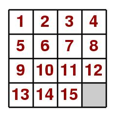

<h1 align="center">
<pre>
______ _  __ _                   ______              _        _____       _                
|  ___(_)/ _| |                  | ___ \            | |      /  ___|     | |               
| |_   _| |_| |_ ___  ___ _ __   | |_/ /   _ _______| | ___  \ `--.  ___ | |_   _____ _ __ 
|  _| | |  _| __/ _ \/ _ \ '_ \  |  __/ | | |_  /_  / |/ _ \  `--. \/ _ \| \ \ / / _ \ '__|
| |   | | | | ||  __/  __/ | | | | |  | |_| |/ / / /| |  __/ /\__/ / (_) | |\ V /  __/ |   
\_|   |_|_|  \__\___|\___|_| |_| \_|   \__,_/___/___|_|\___| \____/ \___/|_| \_/ \___|_|
</pre>
</h1>

<h4 align="center">
  A simple CLI program for finding optimal solution for Fifteen puzzle.
</h4>


<p align="center">
	
</p>

<p align="center">
  <a href="#overview">Overview</a> •
  <a href="#key-features">Key Features</a> •
  <a href="#how-to-use">How To Use</a> •
  <a href="#license">License</a> 
</p>
<h4 align="center">
  
</h4>

## Overview
This project was created for Artificial intelligence and expert systems course on Technical University of Lodz.
The Fifteen Puzzle is a logic puzzle consisting of a square board divided into 16 squares. It contains numbers from 1 to 15 and one empty space, which always remains empty, allowing adjacent tiles to be moved. The goal of the Fifteen Puzzle is to arrange the tiles in numerical order, with the numbers placed in ascending order, leaving the last space empty.
The Fifteen Puzzle can be interpreted as a graph, where each node represents a board state. The edges connecting the nodes represent possible moves between states. The root of such a graph is the initial unsolved state of the puzzle.
Interpreting the Fifteen Puzzle as a graph allows us to apply graph search methods to find solutions.

## Key Features
The search methods we have implemented are:
* Additional statistics for method comparison
* Support for NxM board sizes
* BFS (breadth-first search) – searches all nodes at the current depth before moving to the next level.
* DFS (depth-first search) – explores as deeply as possible before backtracking to examine other branches.
* A (A-star)* – selects the most promising node based on heuristics.
  - Hamming heuristic – counts the number of tiles that are not in their correct positions.
  - Manhattan heuristic – calculates the sum of the moves each tile needs to reach its correct position.

## How To Use
This application solves puzzles saves in text files:
```
4 4
1 2 3 4
5 6 7 8
9 10 11 0
13 14 15 12
```
Where the first row represent width and height of the board and rows after that directly correspond to values in board cells. 

To clone and run this application, you'll need [Git](https://git-scm.com), [Python 3](https://www.python.org/downloads/) and [numpy](https://numpy.org/install/)  From your command line:
```bash
# Clone this repository
$ git clone https://github.com/MatixExport/fifteen-puzzle-solver

# Go into the repository
$ cd fifteen-puzzle-solver/src

# Example app execution that solves the puzzle saved in example.txt with bfs strategy, LEFT-RIGHT-UP-DOWN move order and saves the
#solution in output.txt and additional statistics in stats.txt
$ python main.py example.txt bfs LRUD output.txt stats.txt

#To view all possible arguments, type: 
$ python main.py --help
```


## License

Apache-2.0


